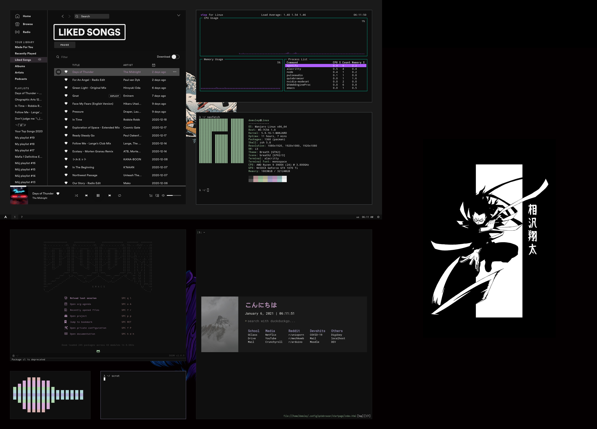

polybar

# Still in progress!
Primarly used on Arch based distro

## Theme
[Mountain](https://github.com/pradyungn/Mountain)

## Apps / Dependencies
- [Polybar](https://github.com/polybar/polybar) - Status bar
- [Alacritty](https://github.com/alacritty/alacritty) - Super fast terminal
- [Rofi](https://github.com/davatorium/rofi) - Program launcher
- [Dolphin](https://invent.kde.org/system/dolphin) - File Manager
- [Dunst](https://github.com/dunst-project/dunst) - Notification daemon
- Nitrogen
- Unclutter - Hides your X mouse cursor when you do not need it.
- Zathura - PDF viewer
- [DoomEmacs](https://github.com/hlissner/doom-emacs)
- MEGASync - Cloud
- Qutebrowser
- Discord
- [cli-visualizer](https://github.com/dpayne/cli-visualizer)